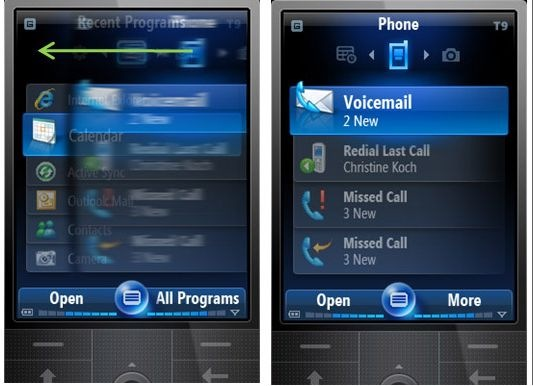

# Windows Mobile to Windows Phone

Owning a Windows Mobile Pocket PC was an experience of a kind, of the kind "use to believe".
The things you could do with a Pocket PC were like emulating MS-DOS or hosting WiFi hotspots (still in 2006 here).

You could use millions of 3rd party applications (ones built with .Net CF), sync your PIM and emails with Outlook Mobile, **writing code**, and the list can just go on.

Microsoft revealed its plans to scrap Project Photon (Windows Mobile 7) and came up with Windows Phone 7 series a few years later that you could think of Microsoft's *answer* to the crazily changing mobile phone market where they kept on dropping basic features that we used to have in our old devices and call it an innovation when they brought it back through updates a few months later... Did I mention **Copy and Paste**?

It still makes me think about how Microsoft decided to create its all-new operating platform for Windows Phone without a file browser.
Things that we were introduced in recent years like expandable memories, wireless file sharing, and USB mass storage mode became irrelevant.

Apple tells you, "it's new". Microsoft tells you, "let's start again". Everyone else just follows.

I always used to plan for my next phone but this time I was in a dilemma: what next?
I'd never buy an iPhone for obvious reasons.
Android still felt so incomplete with that monotonous interface, that changed according to the OEM one bought the device from, as they tried to make it look more like an iPhone.
Getting back to Symbian was not possible because even Symbian was turning 'multi home-screen' just to make it finger-friendly, and in the process, they lost more customers than they gained.

I tried the emulator for Windows Phone 7 on my Visual Studio and a week later decided to buy a Windows Phone maybe for my sins.

We selected *HTC 7 Mozart*, the only phone with a dual Xenon flash and an 8 Mega-pixel camera, both at once.
I lost a file browser, wireless file sharing, USB mass storage mode, custom ringtones, and this only forms a small part of the list.

I trusted Microsoft with future updates and received a *crappy* Windows Phone 7.5 update (aka Windows Phone Mango) over a year later.

Note: I typed this text on my Windows Phone, but to transfer it to my PC, one of the simplest (and probably the only) way for me was to email it to my secondary email account. And that's what you call a reboot in technology where you need emails to transfer your data from a device to another... Heard of local sync Microsoft?
