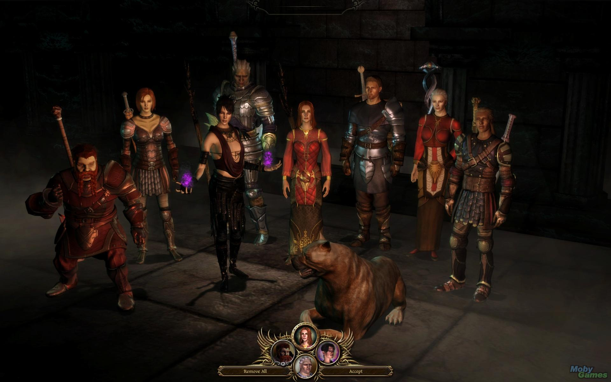

# Can a video game consume you?

*Consume you*? That depends on the gamer, the genre or the game itself. Personally, a few games sort of consumed me in the last few years to an extent that I started mixing the world outside with that inside.

Most people play games to kill time and as I see nowadays in Mumbai, many do it because everyone else does it during the commute. Maybe the definition of video games has changed as now we call "shooting birds at pigs", "crushing candies" or "running from chimpanzees collecting giant coins" as gaming and the losers investing time to do that as gamers. I disagree.

So, getting back to video games, I've discovered in recent years that the RPG (role-playing games) genre suits me well. From *Fallout* to *Mass Effect* to *Dragon Age* to *Deus Ex*. Video games can consume you and according to me, below are some symptoms one would experience when a game has consumed their life:

* **You feel like you have more than one personality:** You tend to feel that you are more important than what your friends, family, colleagues and other people around you think you are. You have a purpose in life, objective to complete and yes: your actions make a difference in saving the world from extinction.
* **Real life feels boring:** Real life can start getting boring when there are so many interesting things going on in the virtual world. Given an option, what would you rather want to do: *travel to and fro between your home and work* or *help a team of most talented creatures you gathered to save the galaxy*?
* **You have imaginary friends:** When you start to realize that you have some imaginary friends who no one around you seems to recognize. You know them by names, you know what they would act like in a particular situation you're in. Sometimes they know you more than your family and friends in the real world (and vice-versa).
* **You're confused between real and virtual:** You do not know if this is all real and you tend to believe that if this goes wrong, you can load from a previously saved game and do it all over again, differently and with more style.

With games like *Mass Effect* and *Dragon Age*, I met some of the sweetest people like *Dr. Liara T'Soni* (Mass Effect) and *Sister Leliana* (Dragon Age), made some best friends like *Garrus Vakarian* (Mass Effect), *Joker* (Mass Effect) and *Alistair* (Dragon Age), got to know some interesting people like *Thane Krios* (Mass Effect), *Jack* (Mass Effect) and *Morrigan* (Dragon Age) and learned from those elderly people who are always there to teach you a thing or two like *Samara* (Mass Effect), *Javik* (Mass Effect) and *Wynne* (Dragon Age).

I have spent over 263 hours in the Mass Effect universe, around 61 in Dragon Age and hope to get a chance to spend more. To conclude, whether I am in the game or am I talking to you, I always live in the video games universe.
