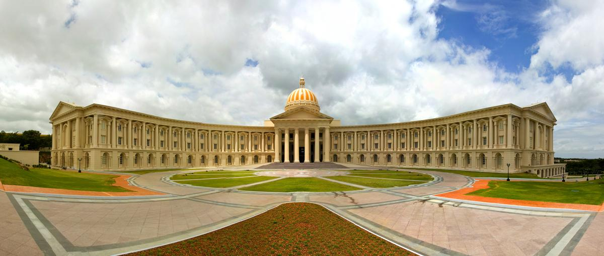
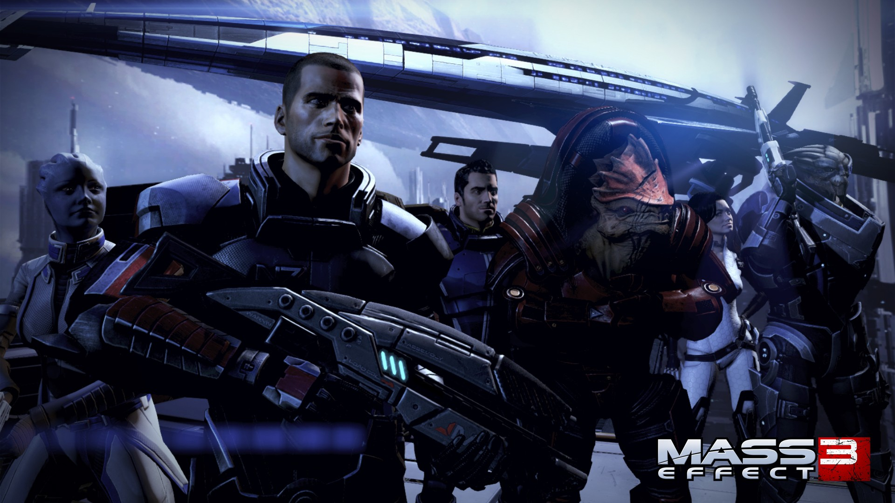
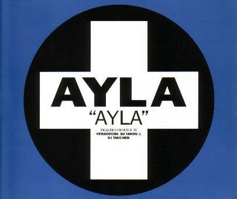
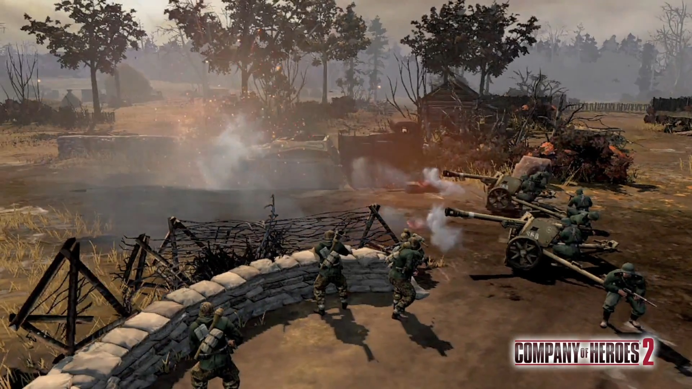

# 6 Things That Altered My Personality

There have been numerous instances in my life that made me feel a change in the way I feel about myself and the world around me. Below are a few of the ones that I realized.

## My Job at Infosys Limited, Mysore

My day zero at Infosys Limited at Mysore changed me from a student to a valued professional. It meant so much of respect, resources and stuff around me. I wasn't expected to *earn* marks in an exam or to replicate stupid handwritten material anymore and I could do something that made a difference in the real world. As a bonus, I had the liberty to decide for which of the five food-courts I could dine in at any point in time and whether to ride on a red or pink bicycle on my way to the food court.

## Computers

Since I met computers in 1997, they have helped me grow continuously. They helped me improve my handwriting, language, the way I look at things and myself, and every other way that I do not realize today. Today they form the means for me to earn a living and give me a reason to wake up every day to this boring real life and to make myself useful to the world around me, sometimes through OSS.

Programming languages like Visual Basic and JavaScript changed the way I think and Emacs has changed me the way I look at text-editors. Linux has made me realize that one can make the other's life better for free. As of 2016, it has been around twenty years and they continue to change me every single year with something new to be excited about.

## Mass Effect

Mass Effect has given me a bunch of memories of a lifetime and plenty of imaginary friends who continue to inspire me even when they're not on my screen. I have gone through emotions that a non-gamer would not expect someone to go through while playing a video game (and I would argue with you if you call it just a video game). In 2016, four years after the end of the original trilogy, I can still cry at the soundtracks.

## Ayla

Ayla trances have been a few of the most *beautiful* instrumental soundtracks I've listened to since I've been listening to trance music. During those few months of 2010, I realized the human mind and heart are two separate entities and I can almost give the credit to the composer.

## Getting Married

Getting married has turned my life into a real-time strategy game where you have to manage a hell lot of resources and a complete unimaginable number of quests with an almost infinite number of constraints without pissing off an uncountable number of allies. Every day is a new chapter with numerous quests to be completed most satisfyingly for all the NPCs and balancing expectations and realities of others and yourselves.

## My Visit to the US

My visit to the United States of America made me realize that not all humans are selfish mindless zombies. There can be a way of living where no one gets hurt and everyone gets all the respect that they deserve and the world does not need a human to be physically present for a task that can be performed by a machine.

