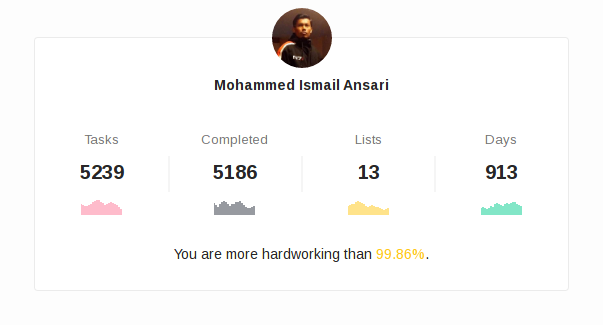

# Moving away from TickTick (to RTM)

About three years back, I learned that having a [GTD](https://en.wikipedia.org/wiki/Getting_Things_Done) (Getting Things Done) tool as an assistant matters more than most people would think. People have told me that it is not good to rely on computers for your daily tasks and laugh at me when I share my secret of meeting deadlines and showing up with complete tasks.

## My Quest to find a GTD

I started looking for a To-Do application that I could use to note down tasks and have timely reminders. Coming from [Windows Mobile](https://en.wikipedia.org/wiki/Windows_Mobile) background, I was looking for something reliable and portable, syncing with Google Tasks would be great. I made my way through [Todoist](https://todoist.com), [Wunderlist](https://www.wunderlist.com/), [BusinessTasks](https://play.google.com/store/apps/details?id=com.appgenix.biztasks), Toodledo, [Remember The Milk](https://www.rememberthemilk.com) and many more. For various reasons, none of these suited me. Some provided with an Android home-screen widget only in the paid version, whereas some offered basic features like sub-tasks and reminders only in the Premium version. The most interesting was the *Remember The Milk*, which along with a good set of supported platforms (including a couple of Emacs extensions) and APIs, provided a very good interface, at least for the Android application. However, it limited the sync to only once per 24 hours.

Ignoring that it could not sync with Google Tasks, I settled with *TickTick* for its great feature set for the free account, awesome platform support, and an awesomely light-weight web application.

## How TickTick made me stick for 913 days

I used *TickTick* for 913 days, and as they say, as of my 29th birthday on 4th December 2016, I was more hard-working than 99.86% of the *TickTick* users.

### Unlimited, Reliable sync

*TickTick* provides a reliable sync feature, unlimited and free to use. This means I could use it at all my devices: my BlackBerry Passport, my home workstation and the computer I use for work.

### Web App

The web application for *TickTick* is customizable, light-weight, as 'featureful' as the native application and works great. This is where I added most of the tasks at work and home.

### Usability

*TickTick* is one of the easiest tools to use. You could do everything effortlessly and with the least amount of clicks. Yet, you would not miss anything.

### Simple but comprehensive

*TickTick* is easy to start with, and as you grow deep into the GTD thing, you can expand creating more lists, tags, add people to your lists and share tasks with them.

### Custom repeats

It would not take long for you to realize that some tasks repeat every day, some every month and some come back after a definite time when you've completed them. *TickTick* also provides one of the most comprehensive repeat systems you would have seen.

### Multiple reminders

How about being reminded with what you need to do multiple times: once a few days before, once a few minutes before the due time? *TickTick* does that.

### Task delegation

You can delegate tasks and share lists with your teammates for free. You just hit share, and it appears on their list.

### Lists, sub-tasks, priorities, notes & more

You can organize tasks by creating lists, nesting them into folders, add sub-tasks, prioritize tasks, add notes and so much more.

### Looks good

The user interface is clean, uses space optimally, looks great and appealing. Elements are sized properly, colors are not too flashy making it look professional enough.

### Almost free

With *TickTick*'s free account, you get almost everything you need from a GTD application, without a need to get a Premium account. The premium account offers more flexibility in what you do like more lists, more collaborations, etc. but you could easily fit all your stuff into a free account, I did it for almost three years.

## Moving to Remember The Milk

I gained a new hobby: looking for GTD and project management tools. I made multiple attempts to try something new and migrate to it. I tried *Todoist*, *Wunderlist* multiple times but could not make my mind to move. I even moved my data manually a couple of times intending to move permanently but I kept coming back within minutes.

*TickTick*'s business model changed, allowing one to only create a few lists for a free account. They started showing alerts that you need to upgrade to a Pro account, which allowed me to move to Remember The Milk. It has changed now: a fresh look for both, the native Android application as well as the website. Sync is now free with the cost of reminders being limited to only the Premium account. The new application is fast and neat as the earlier version and the web application is full of keyboard shortcuts, something that I appreciate everywhere I go (I suffer from [CTS](https://en.wikipedia.org/wiki/Carpal_tunnel_syndrome)).

*TickTick* is still a great GTD system and I have gotten many people into GTD with it.
