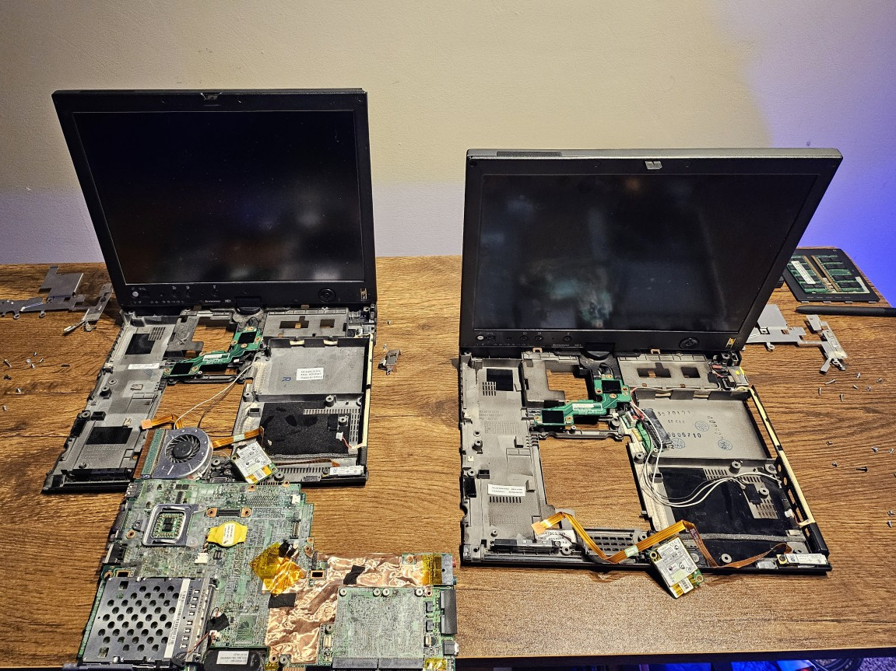
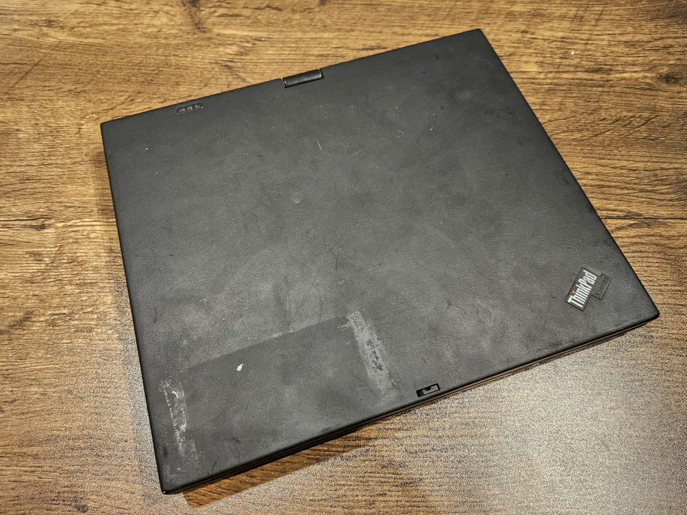
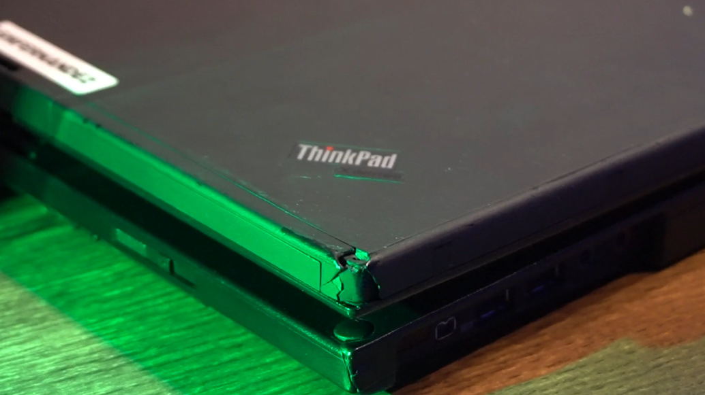
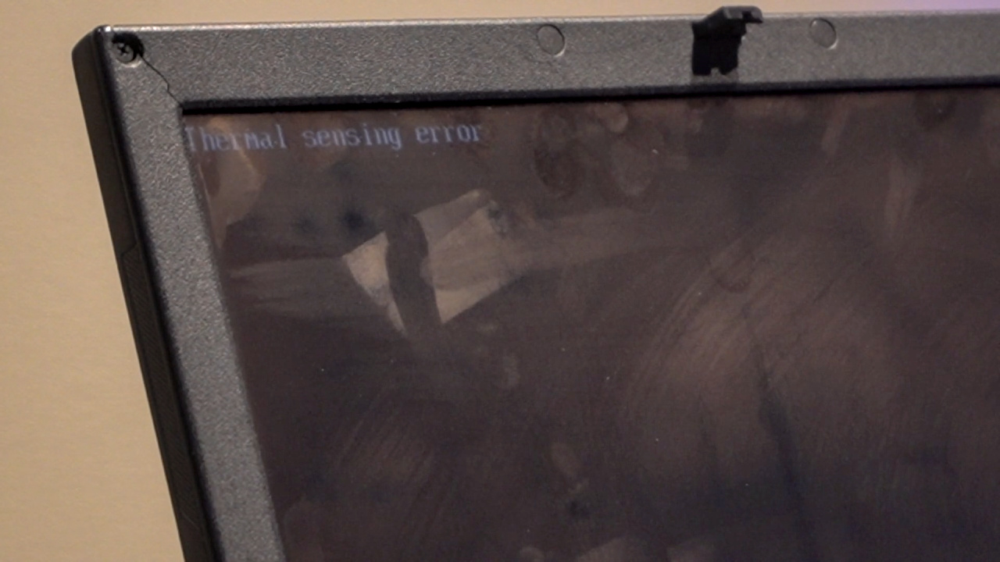
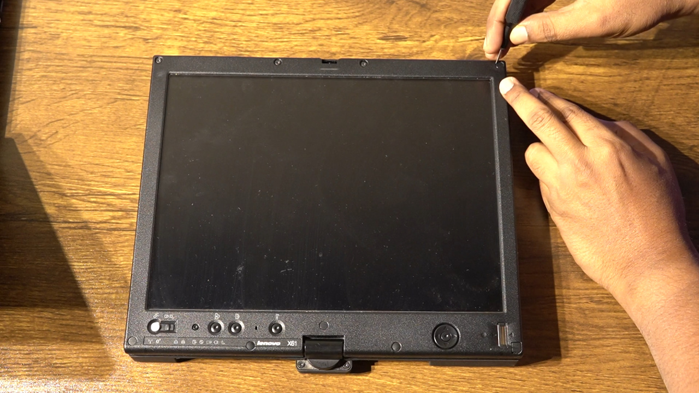
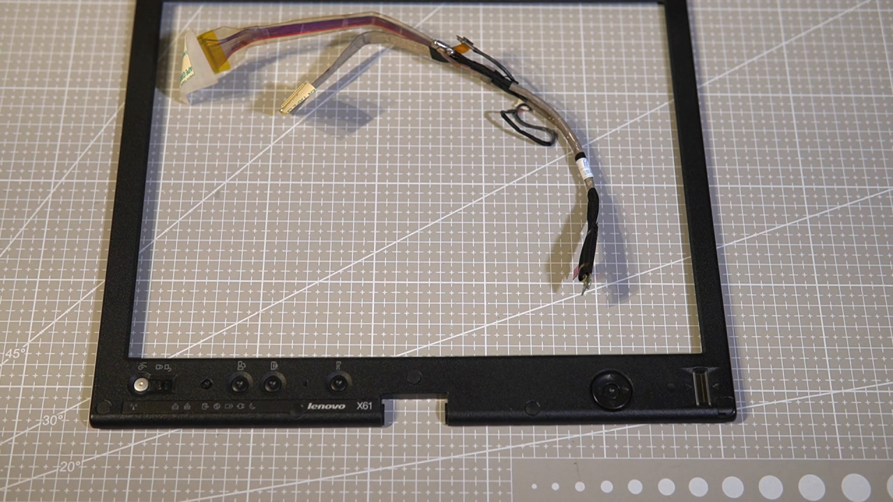
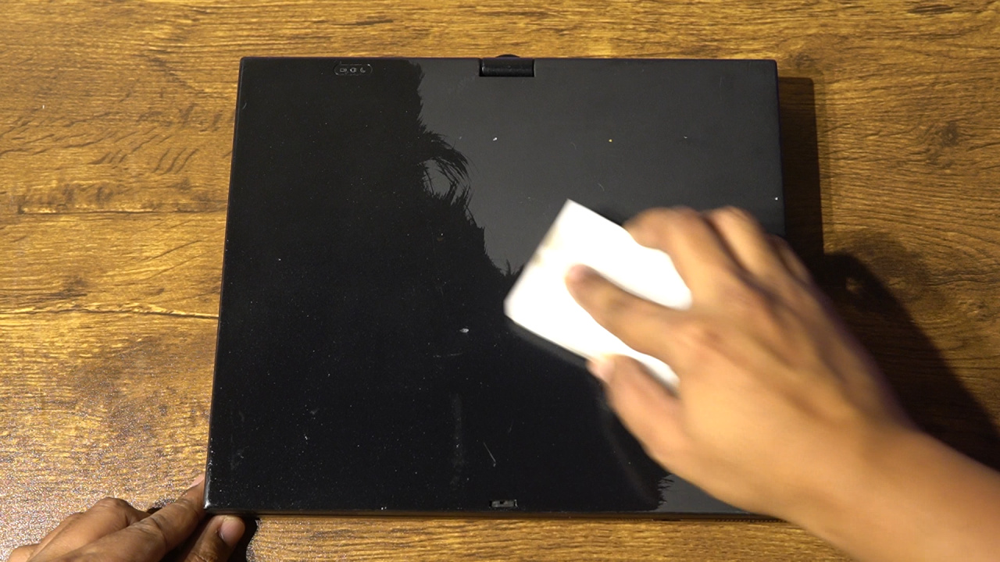

# My X61 Tablet Build Was a Disaster!

It's been a while since I acquired the third kind of model from the X61 family, the X61 Tablet, and, in fact, I have two of these.

Neither of these was a fully functional machine, so I had to use what I learned working with ThinkPads in the last couple of years to create one worthy of joining my fleet, but it took me much longer than I would've thought it would, which is almost sixteen months!

## The X61 Tablet

I learned that, unlike the X61s, which is slightly lighter than the X61, the X61 Tablet is heavier and way bulkier as it adds tablet features. Most of the things are pretty similar to the non-tablet variants, and though the chassis features fewer indents and tapering, including this huge, unusual indent on the bottom right, thicker bezels with a few buttons on it, the most highlighting feature is the swivel hinge, accompanied by the garaged stylus pen. One weird thing I found about these ancient stylus pens is that they were active pens, but they still did not need a battery, nor did they charge from the machine when they were holstered, unlike the Yoga models that came later on.

## Why Not Buy a Working Machine?

So why wouldn't I buy a working machine straightaway, you'd ask? Well, for starters, I wasn't really ready to get into one of these. And then, even if you were looking for one, neither do these machines show up for sale that often, at least at a price that would be convincing for an 18-year-old machine. I picked up my first “for parts” machine when a seller sent me an offer, and that is when the story started.

## Machine 1

So the first machine was clearly listed as “for parts” by the seller, who apparently tried to get it to work, but eventually gave up and put it up for sale, cutting their losses. By the way, this machine went through some cleaning, and it looks way better now than when it arrived.

Some of the major issues were as follows:

1. One of the first things you'd notice is **the cracked screen bezel with a missing screw cover**.
2. Almost all corners of this machine were worn, which isn't pretty at all.
3. The machine was missing the drive-bay cover.
4. The TrackPoint tip was missing, and for a machine that doesn't have a trackpad, unless you count the touchscreen, the TrackPoint is the only means of navigating using a cursor in a graphical environment.
5. The screen was damaged, and the color temperature was way off for comfort.
6. The seller also mentioned that the machine was missing a wireless card, which means no connectivity to the internet without being tethered to an Ethernet cable.
7. A battery was included, but the seller didn't mention the condition or charge capacity, and in such cases, it's best to assume it doesn't work, which is exactly what I did.
8. And yes, the machine threw a Thermal Sensing Error on boot and required an Esc keypress to proceed. Internally, the CPU fan kept turning ON and OFF. This one was new to me, but it was a hint that this was indeed a “for parts” machine.

The seller also tried lubricating the fan, so it dripped some oil back when I received it, and there's still a lot of smell.

If you ignore the sticker residues and some other surface blemishes, the rest of the exterior was pretty intact. Most important of all was the swivel hinge, which isn't that easy to find in good condition today.

## Machine 2

If you think the machine we talked about was in a bad condition, wait till we talk about the other machine that I later picked up. I was specifically looking for a machine that had better internals, and I could deal with broken exterior parts.

This machine was pretty beaten up and might be the worst I've seen (and especially bought). Oh, and it stinks! This might be the first ThinkPad that I refused to clean, and I've cleaned some pretty dirty ThinkPads during my restoration process in the last few years. For this machine, though, I'd rather wash my hands every time I work on it, instead of trying to clean it.

As for the issues on this one,

- The display hinge wobbled badly, even when the lid was closed.
- Worn corners were not even a thing for this machine, given several smashed corners.
- The cover latch was missing, along with a part of the cover itself, so it's a see-through.
- The express card slot cover was missing.
- Even the stylus pen was terribly worn.
- TrackPoint tip was present, but appeared burnt!
- The screen did work, but was going bad in a few spots.
- It came with a battery with a damaged exterior, but at least it charged and reported a remaining health of 96%.

The seller didn't know if the system would even start, as they did not have a compatible charger, and I took a chance. With all the beating this machine has taken, it booted as soon as I connected the charger. It also proved that the battery was charging, and it turned out that even the battery from the other system seemed to work. Man, are these batteries expensive, even old ones, and going for more than three to four times as much as these machines, especially in the condition I picked these in.

This means that I could salvage not only the motherboard, but also other things present here, including the drive-bay cover, some RAM, some screw covers, and some other parts that I might hold on to, given how rare these things are getting with time.

## Additional Parts

One additional part that I had to order was a replacement screen. I got lucky with a deal on eBay, such that I picked up a brand new screen for half the regular price. Maybe the seller just wanted to get rid of it, just the way the two X61 Tablet sellers did.

## Attempting the Build

My initial plan was to use only the motherboard, wireless card, and the drive-bay cover from the second machine, and pretty much everything else from the first one. I took the motherboard from Machine 1 and put it in Machine 2, only to find that there's no Thermal Sensing Error anymore, though the CPU fan was turning ON and OFF.

I took the supposedly working motherboard from Machine 2 and placed it into Machine 1, only to find that it still had the Thermal Sensing Error.

If the motherboard itself doesn't fix the issue, it only leaves a handful of components in the two chassis that weren't swapped:

- The screens
- Display controllers
- SATA controllers
- Bluetooth modules

Not looking at the screens and the Bluetooth modules, comparing the rest two elements, I went with swapping the SATA controllers along with the power input. Surprisingly, this still did not solve the issue with Machine 1, leaving only the display controller, which I thought was impossibly hard to disassemble.

This is where I put the restoration on hold for several months. I started to reconsider whether this was going to get me anywhere close to a single working machine. Meanwhile, I could find X61 Tablet examples for sale online in perfect condition, for similar prices as much as I spent on either of the machines. So, at this point, it was not about building something that wasn't available, but trying to justify all that effort and money spent to at least get something out of it all.

## Replacing the Display Controller

After almost a year, instead of replacing the display controllers, I thought I'd start with replacing the screen, hoping maybe the screen is the culprit. I went on to extract the screen from machine 2, the more broken one, and firstly, it was probably my most brutal teardown, with the front bezel glued down to the screen, and then I found broken pieces and missing screws inside, so in general, this machine was as wild inside as it was from the outside. With the connectors carefully taken out, the screen was out of the system. Now, it was time to remove the screen on machine 1, which I wanted to preserve more of, except for the already broken corner of the front bezel.

I repeated the process here as well, but thankfully, the glue on this one didn't cause much resistance. Before replacing the screen, which appeared to have a screen protector that the other one did not have, I cleaned it up a little. Then, I placed it back to machine 1, and made it stick there with a couple of screws to find that there wasn't any error anymore. To be sure, I did it once more, this time booting from the external USB into Void Linux, and it did seem to work. So that means the issue was in fact the screen, and had I simply replaced it, I wouldn't have had to go through the messy procedure of swapping internal components between the two. As a matter of fact, I already had a replacement screen, so had I decided to even stay with the thermal sensing error, which, as I've come to know, a few people tend to ignore, it would have taken care of itself automatically. But, I remembered that the digitizer used to work in Windows 7, even though I couldn't get past the login screen, and I realized it didn't work anymore. The smile on my face quickly turned into a frown, and this was the point when I realized this isn't going to end with a happy ending, and I didn't even want to record anymore. I tried a few more things.

1. The problematic screen in the other machine, and the digitizer didn't work there.
2. Moreover, there wasn't any thermal sensing error either.
3. Then, I tried with the replacement screen I had purchased for this machine last year, and that didn't let me use the digitizer either, but gave me the Thermal Sensing error again.

So even if I could replace the digitizer cable, there's still the possibility of the thermal sensing error returning, and maybe something else would be the problem then.

## Ordering More Parts

After putting so much time, effort, and money into this machine, a part of me didn't want to give up, so I ordered a replacement display and digitizer cable, and also a screen bezel.

While I waited for it, I also ordered a drive-bay cover with a screw, as it was broken, and I also lost the screw during my ownership.

## Cleaning Up

While I waited for the parts to arrive, I gave the machine an IPA wipe and kept it in a box with some baking soda to get rid of most, if not all, of the bad smell.

Post that, it was ready for the rest of the fixes.

## The Other Machine

Looking back at the donor machine, it was different in several areas, including how the palmrest was a single piece instead of two separate pieces on the machine 1. Also, I wish I could have kept the IBM emblem instead of the ThinkPad X-Series emblem, but the palmrest was broken beyond redemption.

## Final Attempts

As soon as I had the parts, I gave it a try with the new screen, new digitizer cable, and the new display bezel. Unfortunately, it still did not work, and I put it all back into a box to return back to some other time. May be I can sell the spare parts, and most importantly, the batteries, and get most of the money back. 

## In the End

So, not all experiments succeed, and sometimes we have to live with a bad ending, which is the case for these two machines, and that too after sixteen long months of anticipation and wait.

## Abandoned Future Upgrades

If at all this could have worked, I had planned for a Middleton BIOS upgrade, a wireless card upgrade to my favorite Intel Centrino Ultimate N-6300, and of course, more RAM when the prices come back down, if at all they do.

## Conclusion

Just like my ThinkPad X61s, this X61 Tablet we have here isn't the most practical notebook computer/tablet for today's computing. However, it reminds me of my i-mate JasJar from back in the day, as that device had a similar convertible form factor with a swivel hinge, back when a 3.6” screen was considered huge. Also, this machine in a way makes me appreciate the refinement future designs went through to create the modern 2-in-1 Yoga's we have today. I wish I could have been able to add it to my fleet.

## Outro

That's all that I have for this video. Thanks for watching it till the end, may the maker watch over you, see you in the next video!
